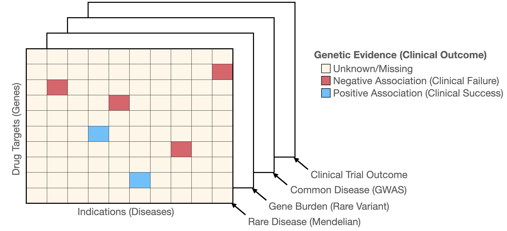

This repo contains detailed information on data and methodology used in our work presented at ICML 2022 Computational Biology workshop.

[Extended abstract](https://icml-compbio.github.io/2022/papers/WCBICML2022_paper_73.pdf) | [Poster](docs/icml-2022-poster-camera-ready.pdf)


Schematic representation of 3-rank tensor with sparse data available on genetics evidence and clinical outcome.

## Data and Methods

We integrate three lines of human genetics evidence across rare disease, gene burden and common disease. We also use NLP-based classification of clinical outcomes to label clinical "failures". All the data used in this analysis are retrieved from the latest release of Open Targets platform [v22.06, Data downloads](https://platform.opentargets.org/downloads)

### Rare disease

| Data source                                                                                           |    Positive label    |       Negative label |
| ----------------------------------------------------------------------------------------------------- | :------------------: | -------------------: |
| [ClinGen](https://platform-docs.opentargets.org/evidence#clingen)                                     | Definitive or Strong | Other classification |
| [Genomics England PanelApp](https://platform-docs.opentargets.org/evidence#genomics-england-panelapp) |        Green         |                Amber |

### Gene burden

| Data source                                                                     |        Positive label         | Negative label |
| ------------------------------------------------------------------------------- | :---------------------------: | -------------: |
| [REGENERON](https://www.nature.com/articles/s41586-021-04103-z)                 | $P\le 2.18 \times {10^{−11}}$ |           Else |
| [AstraZeneca PheWAS Portal](https://www.nature.com/articles/s41586-021-03855-y) |  $P\le  2 \times {10^{−9}}$   |           Else |
| [Genebass](https://www.medrxiv.org/content/10.1101/2021.06.19.21259117v4)       | $P\le  6.7 \times {10^{−7}}$  |           Else |

### Common disease

| Data source                                                                                                                | Positive label  | Negative label |
| -------------------------------------------------------------------------------------------------------------------------- | :-------------: | -------------: |
| [Locus-to-gene "L2G" score](https://genetics-docs.opentargets.org/our-approach/prioritising-causal-genes-at-gwas-loci-l2g) | Score $\ge 0.5$ | Score $ < 0.5$ |

## Citation

If you find this work useful, please cite it as follows:

```bibtex
@inproceedings{human_genetics,
  author = {Onuralp Soylemez},
  title={Bayesian tensor factorization for predicting clinical outcomes using integrated human genetics evidence},
  url = {https://icml-compbio.github.io/2022/papers/WCBICML2022_paper_73.pdf},
  maintitle = {ICML 2022},
  booktitle = {The 2022 ICML Workshop on Computational Biology},
  year = {2022},
}
```
